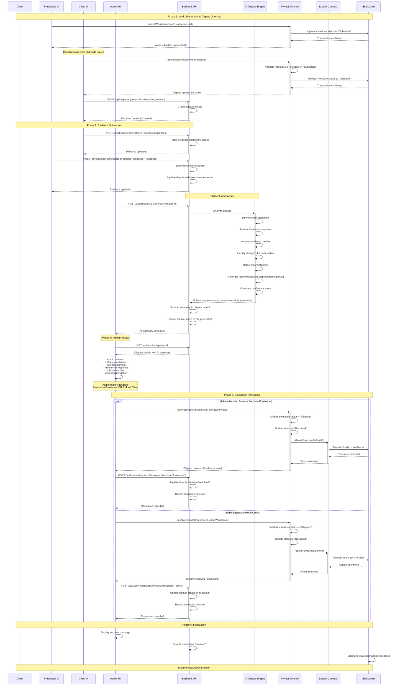

# Dispute Resolution Flow - Sequence Diagram

## Overview
This document illustrates the complete end-to-end flow of a dispute in LancerScape, from work submission to final resolution.

---

## Mermaid Sequence Diagram



---

## Flow Breakdown

### Phase 1: Work Submission & Dispute Opening
1. **Freelancer submits work** on-chain with evidence hash
2. **Client reviews work** and decides to dispute
3. **Client opens dispute** on-chain (milestone → "Disputed")
4. **Backend creates dispute record** for tracking

### Phase 2: Evidence Submission
5. **Client uploads evidence** to backend (statements, files)
6. **Freelancer uploads counter-evidence** and response
7. **Backend stores all evidence** with metadata

### Phase 3: AI Analysis
8. **Admin triggers AI analysis** via backend
9. **AI Engine processes:**
   - Client's reason/statement
   - Freelancer's response
   - Evidence file hashes
   - Identifies strengths for both parties
   - Detects inconsistencies
10. **AI generates recommendation** with confidence score
11. **Backend stores AI summary** and updates dispute status

### Phase 4: Admin Review
12. **Admin views dispute details** including AI recommendation
13. **Admin reviews all evidence** and AI reasoning
14. **Admin makes final decision** (release or refund)

### Phase 5: Blockchain Resolution
15. **Admin calls resolveDispute()** on Project contract
16. **Smart contract validates** dispute status
17. **Escrow contract executes:**
    - `releaseFunds()` → Pay freelancer, OR
    - `refundFunds()` → Refund client
18. **Blockchain confirms transaction**
19. **Backend records resolution** for audit trail

### Phase 6: Finalization
20. **Dispute marked as resolved** in all systems
21. **Milestone state permanently recorded** on-chain
22. **Success notifications** to all parties

---

## Key Decision Points

| Step | Decision Maker | Action | Outcome |
|------|---------------|--------|---------|
| 1 | Freelancer | Submit work | Evidence hash on-chain |
| 2 | Client | Accept or Dispute | Continue or open dispute |
| 8 | Admin | Trigger AI | Get AI recommendation |
| 14 | Admin | Final decision | Release funds or refund |
| 16 | Smart Contract | Validate state | Execute or revert |

---

## Smart Contract State Transitions

```
Milestone States:
  Pending → Funded → Submitted → Approved ✅
                               ↓
                          Disputed → Resolved ⚖️
```

### During Dispute Flow:
- **Submitted** → `openDispute()` → **Disputed**
- **Disputed** → `resolveDispute(false)` → **Resolved** (Freelancer wins)
- **Disputed** → `resolveDispute(true)` → **Resolved** (Client wins)

---

## Data Stored

### Backend (Dispute Record)
```typescript
{
  id: "dispute-uuid",
  projectId: "0x...",
  milestoneId: 1,
  openedBy: "0x...", // client address
  reason: "Work incomplete, missing features X and Y",
  freelancerResponse: "All features delivered as per contract",
  status: "resolved",
  evidenceHashes: ["QmHash1...", "QmHash2..."],
  aiSummary: {
    summary: "...",
    recommendation: "approve",
    confidence: 0.85,
    reasoning: { ... }
  },
  resolution: "freelancer_wins",
  resolvedAt: "2025-11-28T12:00:00Z"
}
```

### Blockchain (Milestone State)
```solidity
struct Milestone {
    string title;
    uint256 amount;
    MilestoneStatus status; // "Disputed" → "Resolved"
    string evidenceHash;
    address freelancer;
}
```

---

## Error Handling

### Potential Failures

| Failure Point | Error | Mitigation |
|--------------|-------|------------|
| Work submission | Gas failure | Retry with higher gas |
| Evidence upload | Network error | Client-side retry logic |
| AI analysis | API timeout | Retry with exponential backoff |
| Blockchain resolution | Invalid state | Contract validation prevents |
| Fund transfer | Insufficient balance | Escrow pre-validation |

---

## Security Considerations

1. **Only admin can resolve disputes** (access control on contract)
2. **Dispute must be in "Disputed" state** (contract validation)
3. **Evidence tampering prevented** by storing hashes on-chain
4. **Double-resolution prevented** by status checks
5. **Funds locked in escrow** until resolution
6. **All actions emit events** for audit trail

---

## Future Enhancements

- **Multi-signature admin** (require 2+ admins to resolve)
- **Time-locked resolutions** (cooldown period)
- **Appeal mechanism** (allow one appeal per party)
- **Partial refunds** (split funds based on AI confidence)
- **DAO voting** (community resolves disputes)

---

**Document Version**: 1.0  
**Last Updated**: November 28, 2025  
**Status**: Phase 1 Implementation Complete
